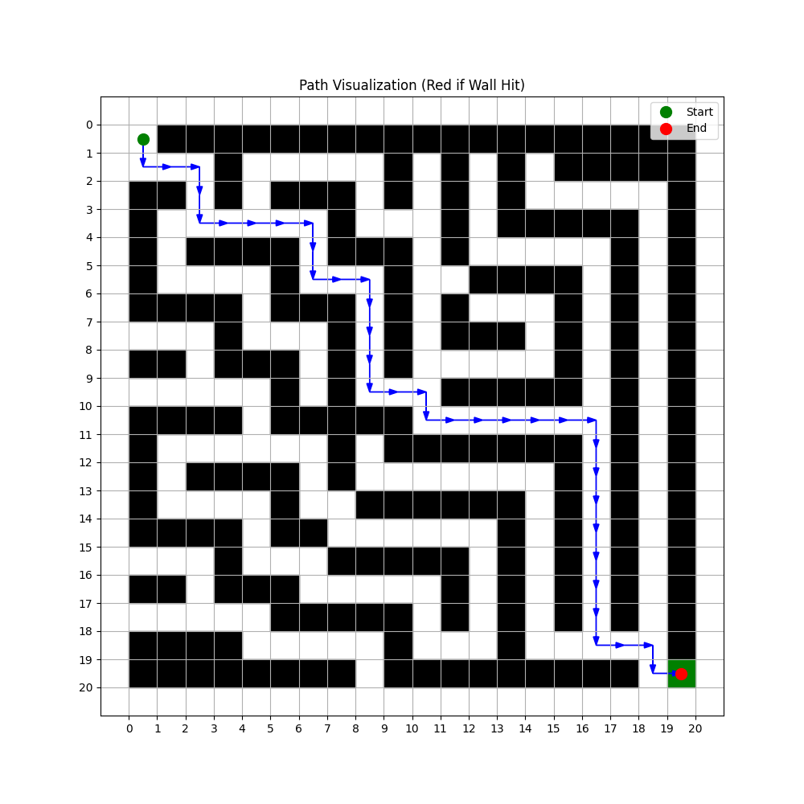
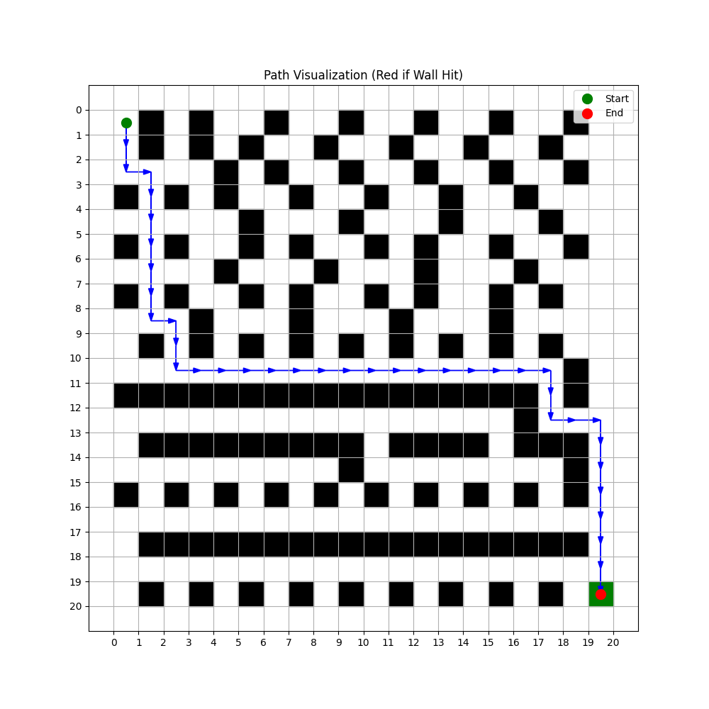

# 🧩 Maze Solver– Q-Learning Pathfinding

A **maze solver** using **Q-learning** for pathfinding. This project defines a custom maze environment with a **20x20 grid maze**, where an agent navigates from the start to the goal, avoiding walls. The project demonstrates **reinforcement learning** applied to solve maze-based challenges.

---

## 📚 Project Overview

This project defines a custom maze environment using OpenAI's **Gym** library. The agent navigates through the maze by selecting actions (Up, Down, Left, Right) and learning optimal behavior using **Q-learning**. The objective is to find a path from the starting position (top-left) to the goal position (bottom-right).

> 📘 This implementation is a simple demonstration of reinforcement learning applied to a maze problem using **Q-learning** in a custom environment built on top of OpenAI Gym.

---

## ✨ Key Features

- 🧠 **Q-learning** – Uses Q-learning to find the optimal path in the maze.
- 🌐 **Custom Maze Design** – A 20x20 maze with obstacles (walls) and a goal position.
- 🎮 **OpenAI Gym Integration** – The environment is compatible with Gym’s interface for reinforcement learning.
- 📊 **Visualization** – The maze and pathfinding process are visualized via **matplotlib**.

---

## 🛠️ Technologies Used

- **Language:** Python  
- **Libraries:** Gym, NumPy, Matplotlib  
- **Concepts:** Q-learning, Reinforcement Learning, OpenAI Gym, Pathfinding  

---

## ⚙️ Environment Details

- **Maze Size:** 20x20 grid.
- **Action Space:** 4 discrete actions (Up, Down, Left, Right).
- **Observation Space:** A flattened 1D state space (size 400, representing the grid positions).
- **Reward System:**
   - Positive reward (+10) for reaching the goal.
   - Negative reward (-1) for each step taken.
   - Large negative penalty (-5) for hitting a wall.

---

## 🎯 Agent Learning

The Q-learning algorithm is used to learn the optimal policy for the agent. The Q-table stores the expected future rewards for each action in each state. During training, the agent explores the maze and updates the Q-table to maximize the cumulative reward.

---

## 🖼️ Path Visualization

After training, the agent’s path can be visualized on the maze grid, highlighting the steps taken to solve the maze. **Walls** are shown in black, the **start** position in green, the **goal** in red, and the **path** in blue. If the agent hits a wall during its journey, it is marked in red.

---

## 📷 Solved Mazes by model

  

---

## 📬 Contact

For inquiries, contact [mahmoudhossam@aucegypt.edu](mailto:mahmoudhossam@aucegypt.edu)
